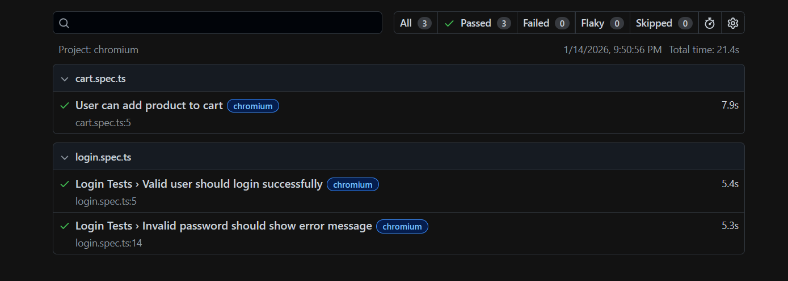

# Playwright Automation Framework (TypeScript)

## Project Overview

This project demonstrates simple end-to-end UI automation framework built using **Playwright with TypeScript**.  
It automates core user flows of an e-commerce application using the **Page Object Model (POM)** design pattern.

---

**Website:** https://www.saucedemo.com/

The application includes:

- User authentication
- Product listing
- Cart functionality

---

## Tech Stack

- Playwright
- TypeScript
- Node.js
- Page Object Model (POM)
- Playwright HTML Reporter

## Report

